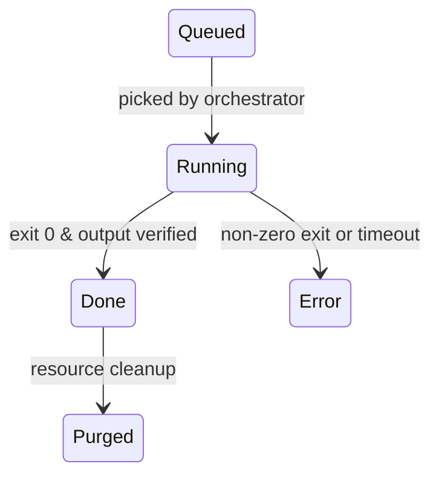

# Manifest Specification (v0.3.6)

> **Purpose**  `manifest.json` is the **single source of truth** that tracks every file and every task inside a *Content‑Studio* pipeline.  Every tool **must** read / patch this document – nothing else.

---

## 1. Top‑level Schema

```jsonc
{
  "id": "string",                // autoincrement or short hash
  "hashId": "string",            // UUID of the content bucket
  "metadata": { /* original‑media level meta */ },
  "fileManifest": [FileItem, ...], // every physical/virtual file
  "tasks": [Task, ...],            // every processing step
  "createdAt": "ISO‑8601",        // UTC
  "updatedAt": "ISO‑8601",        // UTC
  "schemaVersion": "0.3.0"
}
```

---

## 2. `FileItem` Object

| Field | Type | Description |
|-------|------|-------------|
| `type` | `string` | *CamelCase* noun; see table below |
| `version` | `number` | Bump **only** when the binary content changes |
| `path` | `string` | Relative to bucket root |
| `state` | `queued` \| `processing` \| `ready` \| `error` \| `purged` |
| `generatedBy` | `string` | `toolName@semver` |
| `derivedFrom` | `string[]` | zero → *n* upstream `path` values |
| `metadata` | `object \| null` | 类型特定的元数据，见下文 |

### 2.1 Canonical `type` catalogue (v0.3)

| Category | `type` value | Purpose (maps to UI) |
|----------|--------------|----------------------|
| **Originals** | `original_media` | left → 來源 video embed |
|  | `original_thumbnail` | video thumb |
|  | `info_json` | raw yt‑dlp info |
| **Transcripts** | `transcript_en_vtt` / `transcript_zh_vtt` | dual‑lang captions |
|  | `transcript_whisperx_json` | WhisperX word‑level |
|  | `transcript_merged_vtt` | ML‑aligned hybrid |
| **Derived Text** | `text_content_md` | full article shown in *對話*中欄 |
|  | `summary_md` | plain synopsis |
|  | `summary_rich_json` | structured summary **(NEW)** – includes `highlights[]`, `importantTopics[]` → 左欄「來源導覽」卡片 |
| **Audio** | `extracted_audio` | WAV 16kHz |
|  | `speech_summary_audio` | TTS output **(NEW)** – 右欄「語音摘要」播放按鈕 |
| **Images** | `screenshot_collection_json` | metadata for extracted video screenshots **(NEW)** |
|  | `screenshot_image` | individual screenshot image **(NEW)** |
| **AI Interactions** | `text_chat_history_json` | conversation with AI about text content **(NEW)** |
|  | `image_chat_history_json` | conversation with AI about screenshots **(NEW)** |
|  | `chat_collection_json` | collection of all AI conversations **(NEW)** |
| **Knowledge Units** | `topic_tags_json` | tag list **(NEW)** – chips under 「重要主題」 |
| **Articles / Notes** | `article_md` | user‑authored note **(NEW)** – 右欄「記事」列表 |
| **Misc** | `log_txt` | processing log for debugging |

### 2.2 类型特定的元数据

不同类型的文件可以有特定的元数据，存储在 `metadata` 字段中：

```jsonc
// original_media 的元数据示例
{
  "type": "original_media",
  "metadata": {
    "quality": "720p",           // 视频质量："best", "1080p", "720p", "360p"
    "mediaType": "local",        // "local" 或 "iframe"
    "duration": 1234,            // 时长（秒）
    "dimensions": {
      "width": 1280,
      "height": 720
    },
    "previousQualities": ["360p"], // 记录曾经的质量（可选）
    "diskSize": 104857600,       // 文件大小（字节）
    "lastAccessed": "2025-04-18T14:25:36Z" // 最后访问时间
  }
}

// transcript_whisperx_json 的元数据示例
{
  "type": "transcript_whisperx_json",
  "metadata": {
    "modelName": "medium.en",    // 使用的WhisperX模型："tiny.en", "medium.en", "large-v3"
    "wordCount": 1250,           // 单词总数
    "segmentCount": 145          // 段落数量
  }
}

// screenshot_image 的元数据示例
{
  "type": "screenshot_image",
  "metadata": {
    "timestamp": 60,             // 截图时间点（秒）
    "subtitleText": "字幕文本",    // 对应的字幕
    "tags": ["重要", "问题"],      // 用户标记
    "notes": "用户笔记"           // 用户添加的备注
  }
}

// text_chat_history_json 的元数据示例
{
  "type": "text_chat_history_json",
  "metadata": {
    "model": "deepseek-chat",     // 使用的模型
    "messageCount": 8,            // 消息数量
    "lastUpdated": "2025-04-18T14:28:12Z" // 最后更新时间
  }
}
```

---

## 3. `Task` Object

| Field | Type | Description |
|-------|------|-------------|
| `id` | `string` | unique per manifest |
| `title` | `string` | human label |
| `state` | `queued` \| `running` \| `done` \| `error` |
| `percent` | `number` | 0–100 (int) |
| `relatedOutput` | `string` | `FileItem.path` produced/updated |
| `startedAt` / `updatedAt` | `ISO‑8601 \| null` | timestamps |
| `error` | `string \| null` | stack trace |
| `context` | `object \| null` | free‑form args |

### 3.1 Recommended Task IDs ↔ Tools

| ID | Tool | Produces | Triggers when |
|----|------|----------|---------------|
| `fetch_info_json` | `yt‑dlp` | `info_json` | `action:ingest` submitted |
| `download_media` | `yt‑dlp` | `original_media` | `fetch_info_json.done` |
| `upgrade_media_quality` | `yt‑dlp` | 更新 `original_media` | 手动触发或自动规则 |
| `extract_audio` | `ffmpeg` | `extracted_audio` | `original_media.ready` |
| `transcribe_whisperx` | `whisperx` | `transcript_whisperx_json` | `extracted_audio.ready` |
| `merge_transcripts` | `mergeVTT.ts` | `transcript_merged_vtt` | both lang VTT ready |
| `extract_text` | `vtt‑to‑md.ts` | `text_content_md` | `transcript_merged_vtt.ready` |
| `generate_rich_summary` | `ai_summary.ts` | `summary_rich_json` & `summary_md` | `text_content_md.ready` |
| `extract_topics` | `topic_extractor.ts` | `topic_tags_json` | `summary_rich_json.ready` |
| `generate_speech_summary` | `tts.py` | `speech_summary_audio` | `summary_md.ready` |
| `extract_screenshots` | `screenshot-extractor.ts` | `screenshot_collection_json` & multiple `screenshot_image` | `original_media.ready` |
| `initialize_text_chat` | `text-chat.ts` | `text_chat_history_json` | `text_content_md.ready` |
| `initialize_image_chat` | `image-chat.ts` | `image_chat_history_json` | `screenshot_image.ready` |
| `purge_media` | `resource-manager.ts` | 更新 `original_media.state=purged` | 手动触发 |
| `manage_chats` | `chat-manager.ts` | `chat_collection_json` | 用户请求或自动触发 |
| … | | | |

---

## 4. State Machine



`FileItem.state` progresses **independently** of `Task.state` but is usually patched simultaneously by the same worker.

对于 `original_media` 类型，特别支持 `purged` 状态，表示物理文件已被删除但元数据保留。

---

## 5. Example Manifest Snippet (after ingest & yt‑dlp done)

```jsonc
{
  "fileManifest": [
    { 
      "type": "original_media", 
      "version": 1, 
      "path": "original/media.mp4", 
      "state": "ready", 
      "generatedBy": "yt-dlp@2024.12.04", 
      "derivedFrom": [],
      "metadata": {
        "quality": "720p",
        "mediaType": "local",
        "duration": 583,
        "dimensions": { "width": 1280, "height": 720 },
        "diskSize": 104857600
      }
    },
    { "type": "info_json", "version": 1, "path": "original/info.json", "state": "ready", "generatedBy": "yt-dlp@2024.12.04", "derivedFrom": [] },
    { "type": "extracted_audio", "version": 1, "path": "audio/audio.wav", "state": "queued", "generatedBy": "ffmpeg@6.1", "derivedFrom": ["original/media.mp4"] }
  ],
  "tasks": [
    { "id": "fetch_info_json", "title": "Download info.json", "state": "done", "percent": 100, "relatedOutput": "original/info.json", "startedAt": "…", "updatedAt": "…", "error": null },
    { "id": "download_media", "title": "Download media (720p)", "state": "done", "percent": 100, "relatedOutput": "original/media.mp4", "startedAt": "…", "updatedAt": "…", "error": null },
    { "id": "extract_audio", "title": "Extract audio", "state": "queued", "percent": 0, "relatedOutput": "audio/audio.wav", "startedAt": null, "updatedAt": null, "error": null }
  ]
}
```

### 5.1 视频质量升级示例

```jsonc
// 质量升级任务（360p → 720p）
{
  "id": "upgrade_media_quality",
  "title": "Upgrade video to 720p", 
  "state": "done",
  "percent": 100,
  "relatedOutput": "original/media.mp4",
  "context": {
    "previousQuality": "360p",
    "targetQuality": "720p",
    "preserveProcessing": true   // 标记保留已处理的相关数据
  }
}

// 升级后的 original_media 条目
{
  "type": "original_media",
  "version": 2,   // 版本号增加
  "path": "original/media.mp4",
  "state": "ready",
  "generatedBy": "yt-dlp@2024.12.04",
  "derivedFrom": [],
  "metadata": {
    "quality": "720p",  // 质量已更新
    "mediaType": "local",
    "previousQualities": ["360p"], // 记录曾经的质量
    "duration": 583,
    "dimensions": { "width": 1280, "height": 720 },
    "diskSize": 209715200  // 新文件大小
  }
}
```

### 5.2 资源清理示例

```jsonc
// 删除视频但保留处理结果的任务
{
  "id": "purge_media",
  "title": "Delete original media but keep processing results", 
  "state": "done",
  "percent": 100,
  "relatedOutput": "original/media.mp4",
  "context": {
    "keepResults": true,    // 保留处理结果
    "keepThumbnail": true,  // 保留缩略图
    "reason": "disk_space"  // 删除原因
  }
}

// 更新后的 original_media 条目
{
  "type": "original_media",
  "version": 2,
  "path": "original/media.mp4",  // 路径保持不变，但文件已不存在
  "state": "purged",            // 状态更新为 purged
  "generatedBy": "resource-manager@1.0.0",
  "derivedFrom": [],
  "metadata": {
    "quality": "720p",
    "mediaType": "local",
    "duration": 583,
    "dimensions": { "width": 1280, "height": 720 },
    "diskSize": 0,              // 大小为0
    "purgedAt": "2025-05-10T08:15:22Z",  // 删除时间
    "purgedReason": "disk_space", // 删除原因
    "hasOriginalMedia": false  // 已purged
  }
}
```

### 5.3 Example Screenshot Collection

```jsonc
// screenshots/collection.json
{
  "screenshotType": "interval",    // "interval" | "uniform" | "keyframe" | "subtitle" 
  "params": {
    "interval": 60,                // seconds between screenshots for "interval" type
    "count": 10                    // number of screenshots for "uniform" type
  },
  "items": [
    {
      "filename": "screenshot_00001.jpg",
      "timestamp": 60,             // seconds from start
      "subtitleText": "这是相关字幕文本",  // optional, if aligned with subtitle
      "notes": "用户添加的笔记",        // optional user-added notes
      "tags": ["重要", "问题"]       // optional user-added tags
    },
    // ... more screenshots
  ]
}
```

### 5.4 AI Chat Examples

```jsonc
// 文本内容的AI对话示例 (chats/text_chat.json)
{
  "chatType": "text",
  "sourceFile": "transcripts/content.md",
  "model": "deepseek-chat",
  "messages": [
    {
      "role": "system",
      "content": "你是一个帮助分析视频内容的AI助手。"
    },
    {
      "role": "user",
      "content": "这个视频的主要论点是什么？"
    },
    {
      "role": "assistant",
      "content": "根据视频内容，主要论点包括三个方面：..."
    },
    // ... 更多对话消息
  ],
  "createdAt": "2025-04-18T14:25:36Z",
  "updatedAt": "2025-04-18T14:28:12Z"
}

// 截图的AI对话示例 (chats/image_chat.json)
{
  "chatType": "image",
  "sourceFile": "screenshots/screenshot_00023.jpg",
  "model": "deepseek-chat",
  "messages": [
    {
      "role": "system", 
      "content": "你是一个帮助分析图像的AI助手。"
    },
    {
      "role": "user",
      "content": [
        {
          "type": "text",
          "text": "这张图片展示了什么？"
        },
        {
          "type": "image_url",
          "image_url": {
            "url": "data:image/jpeg;base64,/9j/4AAQSkZJRgABAQAA..."
          }
        }
      ]
    },
    {
      "role": "assistant",
      "content": "图片显示的是一个产品演示场景，其中包括..."
    },
    // ... 更多对话消息
  ],
  "createdAt": "2025-04-18T15:40:22Z",
  "updatedAt": "2025-04-18T15:43:05Z"
}

// 对话集合示例 (chats/collection.json)
{
  "version": "1.0",
  "chats": [
    {
      "id": "text-chat-1",
      "type": "text",
      "title": "内容分析",
      "sourcePath": "chats/text_chat.json",
      "messageCount": 8,
      "createdAt": "2025-04-18T14:25:36Z",
      "updatedAt": "2025-04-18T14:28:12Z"
    },
    {
      "id": "image-chat-1",
      "type": "image",
      "title": "截图分析",
      "sourcePath": "chats/image_chat.json",
      "messageCount": 6,
      "createdAt": "2025-04-18T15:40:22Z",
      "updatedAt": "2025-04-18T15:43:05Z"
    }
  ],
  "tags": {
    "重要": ["text-chat-1"],
    "参考": ["image-chat-1"]
  }
}
```

---

## 6. UI Mapping Cheat‑Sheet

| UI 区域 | 读取的 `FileItem.type` |
|---------|------------------------|
| 左栏「來源」视频播放器 | `original_media` + `original_thumbnail` |
| 左栏「來源導覽」摘要卡 | `summary_rich_json` (fields: `highlights`, `importantTopics`) |
| 中栏「對話」全文 | `text_content_md` |
| 右栏「語音摘要」 | `speech_summary_audio` |
| 右栏「記事」列表 | any `article_md` under `notes/` |
| 截图面板 | `screenshot_collection_json` + related `screenshot_image` files |
| 视频设置面板 | `original_media.metadata` (quality, dimensions) |
| AI对话面板 | `text_chat_history_json`, `image_chat_history_json` |
| 资源管理面板 | 所有具有`diskSize`字段的文件类型 |

---

## 7. Conventions & Rules

1. **UTC ISO‑8601** for all timestamps
2. **Semantic Versioning**  `tool@x.y.z`
3. Bump `FileItem.version` only when **binary differs**; metadata‑only edits keep version unchanged.
4. `derivedFrom` must reference **`path`**, not `id` or `type`.
5. Keep the manifest ≤ 1 MB；大对象放独立文件并引用。
6. 视频质量升级时必须更新 `version` 字段和 `metadata.quality`；对于已经完成部分处理的视频，建议在 `context` 中指定 `preserveProcessing: true`。
7. 当视频被删除（purged）时，状态必须设为`purged`，并在`metadata`中添加`purgedAt`和`purgedReason`字段。
8. 使用OpenAI SDK访问DeepSeek API时，应使用以下格式：
   ```js
   import { OpenAI } from "openai";
   const client = new OpenAI({
     apiKey: process.env.DEEPSEEK_API_KEY,
     baseURL: "https://api.deepseek.com"
   });
   ```

---

## 8. Repository‑level Index (`library.json`)

> When the number of buckets grows, keep a *single* shallow index at `storage/content-studio/library.json` so the UI can list all cards without recursively scanning the FS.

```jsonc
{
  "schemaVersion": "0.1.0",
  "updatedAt": "ISO-8601",
  "items": [
    {
      "hashId": "a1b2c3d4-e5f6-7890-abcd-ef1234567890",
      "title": "Steve Jobs: Secrets of Life",
      "platform": "youtube",
      "duration": 100,
      "quality": "720p",             // 添加视频质量信息
      "thumbnail": "storage/content-studio/a1b2.../original/thumbnail.jpg",
      "createdAt": "2025-04-18T11:50:14Z",
      "tags": ["人工智慧", "從看到行動"],   // taken from topic_tags_json
      "summary": "text snippet ≤140 chars", // taken from summary_rich_json.highlights[0]
      "state": "complete",               // quick filter (ingesting | processing | complete | error | purged)
      "diskSize": 104857600,            // 总占用空间（字节）
      "hasOriginalMedia": true         // 是否保留原始媒体（false为已purged）
    }
    /*, ...*/
  ]
}
```

### Index update rules
1. Add item *immediately* after bucket & manifest are created with `state: ingesting`.
2. Orchestrator patches `state` → `processing` / `complete` / `error` / `purged`.
3. Keep only **presentation‑level** fields—do *not* duplicate full manifest here.
4. 当资源被部分清理（只删除视频文件）时，设置`hasOriginalMedia: false`。

---

## 9. Changelog

- **0.3.6**  Add WhisperX model options (tiny.en, medium.en, large-v3) with specific metadata in transcript_whisperx_json.
- **0.3.5**  Add resource management features: purged state, diskSize tracking, and file cleanup strategies.
- **0.3.4**  Add AI conversation features for both text content and screenshots.
- **0.3.3**  Add video quality selection and upgrade functionality with metadata support.
- **0.3.2**  Add `screenshot_collection_json` and `screenshot_image` types for video screenshot extraction functionality.
- **0.3.1**  Add repository‑level `library.json` index section to align with project root layout.
- **0.3.0**  Add `summary_rich_json`, `speech_summary_audio`, `topic_tags_json`, `article_md` to support Notebook‑style UI.
- **0.2.0**  Initial public draft.

